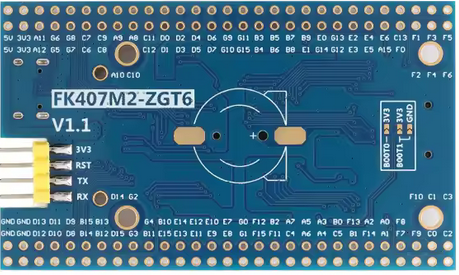

# clock DAC

[notebook](https://colab.research.google.com/drive/1mBSUoHLU5fF2yGJLQd4LiWSCUpsHnCSH?usp=sharing)

- sys clock freq = 80MHz
- PSC 99
- desired timer freq : 100KHz
- solve : => ARR=9

# pinout

- DAC : PA4
- ADC : PA6, PA7, PB0, PB1

# config, freq

| PSC | ARR | cycles | freq KHz |
| --  | --  | --     |  --      |
| 19  | 24  | 15     | 55  |
| 19  | 24  | 28     | 37  |