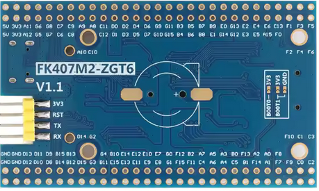

# MCU 

J'ai le mcu STM32F407ZGT6

- pour spécifier la config du hard et générer le code : STM32CubeMX 
  ouvrir beam02/beam02.ioc
  => generate code

- aller dans beam32/Core/Src
  là est le source cpp
  make start
  ca utilise les outils cli : installés dans /mnt/hd1/tools/stm32ide/plugins/com.st.stm32cube.ide.mcu.externaltools.gnu-tools-for-stm32.14.3.rel1.linux64_1.0.100.202602081740/tools/bin/

  je les ai installés avec l'installeur trouvé ici : https://www.st.com/en/development-tools/stm32cubeide.html
  et https://www.st.com/en/development-tools/stm32cubeprog.html
  prendre la version linux generic ( because linux mint 22 )
  

# led embarquée

GPIOC 13

# schéma board FK407M2

[doc pdf ](https://fruitoftheshed.com/wiki/doku.php?id=mmbasic_hardware:armmite_f407xgt6_user_manual_firmware_and_source)

# connecteur debug

5V ( et pas 3.3)

# clock, timer, ADC, DAC

## ADC1 => timer 8

ADC In : pins 6,7,8,9 ( A6, A7, B0, B1)

- sys clock freq = 160MHz
- PSC 99
- desired timer freq : 100KHz
- solve : => ARR=15

## DAC => timer 6

DAC out : PA4

[notebook](https://colab.research.google.com/drive/1mBSUoHLU5fF2yGJLQd4LiWSCUpsHnCSH?usp=sharing)

# pinout

- DAC : PA4 - fil jaune, vers ampli
- ADC : PA6 ( fil bleu), PA7, PB0, PB1

- D1 : fin conversion ADC du groupe , (fil vert)
- B2 : fin conversion DAC   (fil rouge) 
- C13 : led ( freq = k * variance )

- A6, A7, B0, B1 : ADC input

- observation : acquisition a 59.2KHz des 4 canaux
 

# config, freq

| PSC | ARR | cycles | freq KHz |
| --  | --  | --     |  --      |
| 19  | 24  | 15     | 55  |
| 19  | 24  | 28     | 37  |

# application : séparation de source D&S

## Séparation de Source audio avec le STM

### Le but

Isoler une source audio dans un environnement bruité.
Amplifier une source lointaine en gardant le niveau de bruit à un bas niveau.

C'est la technique de la séparation de source et plus précisément du 'beamforming'.

On utilise un réseau de micro disposés selon un arrangement adapté.

En fait, les micros vont être alignés et espacés à intervalles connu et régulier ( par exemple, 4 micros espacés de 10cm).

Ce système est pointé vers la source à isoler.

Le traitement audio est basé sur l'idée du "delay and sum".

### Delay and sum

### Matériel

On veut échantillonner les 4 micros au moins à 20KHz.
